# CivBench System Architecture

This document explains how an LLM agent plays Civilization VI through the civ6-mcp server. It covers the full stack from tool call to game engine and back, the two Lua execution contexts inside the game, and the hardest engineering problems: turn advancement, popup management, and asynchronous operations.

Assumes familiarity with Civ 6 gameplay but not with the game's internals.

---

## How the pieces fit together

The system has five layers. The agent (an LLM like Claude) makes tool calls through the Model Context Protocol. The MCP server translates those into method calls on a GameState object. GameState builds Lua source code, sends it over TCP to the game's FireTuner debug interface, parses the pipe-delimited output, and returns human-readable text to the agent.

```mermaid
graph TB
    subgraph Agent["LLM Agent ‹Claude›"]
        A["System Prompt<br/>CLAUDE.md"] --> B["Turn Loop"]
        B --> C["MCP Tool Calls"]
    end

    subgraph MCP["MCP Server ‹server.py›"]
        D["70 MCP Tools"]
        D --> D1["26 Query Tools<br/><i>get_units, get_cities,<br/>get_map_area, get_diplomacy…</i>"]
        D --> D2["38 Action Tools<br/><i>execute_unit_action,<br/>set_city_production,<br/>diplomacy_respond…</i>"]
        D --> D3["6 Lifecycle Tools<br/><i>end_turn, quicksave,<br/>kill_game, launch_game…</i>"]
        E["_logged wrapper<br/><i>timing, error handling, logging</i>"]
    end

    subgraph GameState["Game State Layer ‹game_state.py›"]
        F["GameState Class"]
        F --> F1["Query Methods<br/><i>build → execute → parse → narrate</i>"]
        F --> F2["Action Methods<br/><i>build → execute → parse result</i>"]
        F --> F3["Turn Management<br/><i>blocker resolution, snapshot diff,<br/>threat scan, victory alerts</i>"]
        F --> F4["Popup Management<br/><i>3-phase dismiss algorithm</i>"]
    end

    subgraph Lua["Lua Query Layer ‹lua_queries.py›"]
        G["Build Functions<br/><i>build_* → Lua source code</i>"]
        H["Parse Functions<br/><i>parse_* → dataclasses</i>"]
        I["Narrate Functions<br/><i>narrate_* → LLM-readable text</i>"]
    end

    subgraph TCP["Connection Layer ‹connection.py›"]
        J["GameConnection"]
        J --> J1["execute_read<br/><i>→ GameCore state 8</i>"]
        J --> J2["execute_write<br/><i>→ InGame state 153</i>"]
        J --> J3["Binary Framing<br/><i>4B length + 4B tag + payload‹NUL›</i>"]
    end

    subgraph Game["Civilization VI"]
        K["FireTuner Debug Protocol<br/><i>TCP :4318, single connection</i>"]
        K --> K1["GameCore_Tuner<br/><i>State 8: Direct simulation R/W<br/>Players, Units, Map, Game</i>"]
        K --> K2["InGame<br/><i>State 153: UI command layer<br/>UnitManager, CityManager,<br/>DiplomacyManager, UI</i>"]
        K1 --> L["Game Engine<br/><i>Simulation state, AI players,<br/>map generation, combat</i>"]
        K2 --> L
    end

    C --> D
    D --> E --> F
    F --> G
    H --> F
    I --> F
    G --> J
    J --> K
    K --> J
    J --> H
    F --> E --> D --> C
```



The key insight is that **the agent never sees pixels**. Everything it knows about the game comes from text returned by tool calls. A human player passively absorbs dozens of signals per second — the minimap, score ticker, unit health bars, fog boundaries. The agent must explicitly query for each one. This is the *sensorium effect* described in the paper, and it's an architectural property of this stack, not a model limitation.

---

## Designing for information parity

A human player looking at the Civ 6 screen receives a dense stream of visual information without asking for it: the minimap shows fog boundaries and territory; the score banner ticks up; a city's growth bar fills; an enemy unit appears at the edge of visibility. The tool suite is deliberately designed to provide **text equivalents for every visual affordance** a human player relies on, so that the information asymmetry between human and agent is a matter of *polling discipline*, not *missing capability*.

The table below maps each human visual affordance to its tool equivalent:

| Human sees | Agent calls | What it returns |
|-----------|-------------|-----------------|
| Fog of war covering the map | `get_game_overview` | `exploration_pct: 32%` — a single number summarising how much of the map has been revealed, equivalent to glancing at how much fog remains |
| Minimap in the corner | `get_minimap` | ASCII grid with symbols: `O`=own city, `X`=enemy city, `~`=water, `^`=mountain, `*`=strategic resource. Shows map shape, territory, and fog boundaries at a glance |
| Strategic view overlay | `get_strategic_map` | Per-city fog boundaries (tiles explored in each cardinal direction) and unclaimed resources outside territory |
| Hex tiles on screen with terrain, resources, units | `get_map_area` | Tile-by-tile breakdown in a radius: terrain type, features, resources, improvements, ownership, yields, and any visible units with bold threat markers like `**[Barbarian WARRIOR CS:20]**` |
| City banner (name, population, production, growth bar) | `get_cities` | Population, food surplus, turns to growth, current production + turns remaining, loyalty, amenities, housing. Includes starvation and stagnation warnings |
| Score ticker at top of screen | `get_game_overview` | Total score, per-player rankings, yield rates (science, culture, gold, faith), era score vs thresholds |
| Diplomacy screen (leader attitudes, modifiers) | `get_diplomacy` | Per-civ relationship state, numerical modifiers with explanations ("+3: Delegation", "-6: Different Government"), military strength comparison, available diplomatic actions |
| Combat preview popup when hovering attack | `attack` action | Pre-combat estimate: combat strengths, all modifiers (terrain, fortification, flanking), predicted damage to both sides, kill probability — runs *before* committing to the attack |
| Religion lens showing city-by-city conversion | `get_religion_status` | Majority religion in each visible city, number of followers per religion, pressure sources |
| Victory progress screen | `get_victory_progress` | Per-civ progress across all 6 victory types, with viability scores (0-100%) and recommended strategy pivots |
| Trade route overview screen | `get_trade_routes` | Capacity vs active routes, per-route yields, trader locations, idle trader detection |
| Great People recruitment screen | `get_great_people` | Available candidates, recruitment cost, current points vs competitors, Great Person abilities |
| District placement lens | `get_district_advisor` | Valid tiles ranked by adjacency bonus, with breakdown of what contributes to each bonus |
| Notification panel (right side of screen) | `end_turn` return value | Events that occurred during the AI turn: units killed, damage taken, cities that grew, production completed, new encounters. Plus threat scan and victory proximity alerts |

Some of these deserve special attention:

**Exploration percentage** is the most compressed affordance. A human player sees fog covering perhaps 70% of the minimap and intuitively knows "I haven't explored enough." The agent gets a single number — `exploration_pct: 32%` — that serves the same function. The system prompt defines benchmarks (25% by T50, 50% by T100) that translate this number into urgency, the same way a human translates visual fog coverage into "I should build another scout."

**The combat estimator** replicates the preview popup that appears when a human hovers over an attack target. It computes combat strengths with all modifiers (terrain defense, fortification, flanking, promotions), estimates damage to both sides using the game's combat formula, and reports kill probability. The agent sees this *before* committing, just as a human does — the difference is that a human sees it by hovering a mouse, while the agent gets it as part of the attack action's pre-check.

**Turn event diffing** solves the hardest parity problem: what happens between turns. A human watches AI units move, sees combat animations, hears the notification sound when a city grows. The agent gets none of this. Instead, the server takes a snapshot before and after the turn, computes the delta, and reports it: "Your Warrior at (36,32) took 15 damage. Delhi completed Monument. Babylon founded a new city." This is less information than the human gets (no visibility into AI unit movements beyond what's in your sight), but it captures the essential state changes.

**Proactive alerts** close part of the polling gap. Even if the agent forgets to check victory progress, `end_turn` runs a victory proximity scan every turn and warns if any rival is close to winning. Growth alerts flag stagnant cities. Threat scans report enemy units near your borders. These are the tool-side equivalent of the game's notification panel — information pushed to the agent rather than requiring active queries.

The remaining gap is structural, not informational: these tools exist but the agent must *choose to call them*. A human player's eyes are always open; the agent's perception is intermittent, gated by tool calls within a turn loop. The system prompt prescribes polling cadences (check diplomacy every 20 turns, check victory progress every 20 turns, check the strategic map every 30 turns), but compliance depends on the agent's discipline — hence the sensorium effect.

---

## The 70 tools

Tools break down into three categories:

**Query tools** (26) are read-only. They ask the game "what's the state?" and return structured text. Examples: `get_units` returns every unit's position, HP, and available actions; `get_map_area` returns a radius of hex tiles with terrain, resources, and any visible units; `get_diplomacy` returns relationship states, modifiers, and available diplomatic actions for every known civilization.

**Action tools** (38) change game state. They correspond to things a human player would click: moving a unit, setting production, declaring friendship, proposing a trade deal. Every action tool validates preconditions before executing (can the unit reach that tile? does the city have that building available? is the diplomatic action valid?) and returns either `OK:` with a confirmation or `ERR:` with a reason.

**Lifecycle tools** (6) manage the game session itself: advancing the turn, saving/loading, and crash recovery (kill the process, relaunch via Steam, reload a save using OCR-based menu navigation).

---

## Anatomy of a tool call

When the agent calls a tool like `get_units`, here's the exact journey:

```mermaid
sequenceDiagram
    participant Agent as LLM Agent
    participant MCP as server.py
    participant GS as game_state.py
    participant LQ as lua_queries.py
    participant Conn as connection.py
    participant FT as FireTuner :4318
    participant Civ as Civ VI Engine

    Agent->>MCP: MCP tool call (JSON-RPC)<br/>e.g. get_units()
    activate MCP
    MCP->>MCP: _logged() wrapper starts timer

    MCP->>GS: gs.get_units()
    activate GS

    GS->>LQ: lq.build_units_query()
    activate LQ
    LQ-->>GS: Lua source code string
    deactivate LQ

    GS->>Conn: conn.execute_write(lua_code)
    activate Conn
    Conn->>Conn: Frame: [length][tag=3][CMD:153:code‹NUL›]
    Conn->>FT: TCP send binary frame
    activate FT
    FT->>Civ: Execute Lua in InGame state
    activate Civ
    Civ-->>FT: print() output lines
    deactivate Civ
    FT-->>Conn: O‹NUL›InGame: UNIT|warrior|31|15|100|2...
    FT-->>Conn: O‹NUL›InGame: ---END---
    deactivate FT
    Conn->>Conn: Collect until sentinel, strip O‹NUL› prefix
    Conn-->>GS: list[str] pipe-delimited lines
    deactivate Conn

    GS->>LQ: lq.parse_units_response(lines)
    activate LQ
    LQ-->>GS: list[UnitInfo] dataclasses
    deactivate LQ

    GS->>GS: narrate_units(units) → human-readable text
    GS-->>MCP: formatted string
    deactivate GS

    MCP->>MCP: _logged() records timing + log
    MCP-->>Agent: MCP tool result (text)
    deactivate MCP
```



Every query follows this same four-step pattern:

1. **Build**: `lua_queries.py` generates a Lua source code string. The Lua uses `print()` to output pipe-delimited fields (e.g. `print("WARRIOR|31|15|100|2")`) and terminates with `print("---END---")` as a sentinel.

2. **Execute**: `connection.py` wraps the Lua in a binary frame — 4-byte little-endian length, 4-byte tag (3 = command), and the null-terminated payload `CMD:153:lua_code` — then sends it over TCP to port 4318. The game executes the Lua and streams back output lines prefixed with `O\0InGame:`. The connection collects lines until it sees the `---END---` sentinel.

3. **Parse**: `lua_queries.py` splits each pipe-delimited line into fields and returns structured Python dataclasses (`UnitInfo`, `CityInfo`, `TileInfo`, etc.).

4. **Narrate**: `game_state.py` converts the dataclasses into human-readable text optimised for an LLM to consume. This is where raw data like `UNIT_WARRIOR|31|15|100|2|FORTIFIED` becomes `Warrior #65536 at (31,15) HP:100/100 moves:2 [FORTIFIED]`.

Action tools follow the same pattern but skip narration — they return a short `OK: moved to (32,15)` or `ERR:STACKING_CONFLICT` result.

---

## The wire protocol

Civ 6 ships with a built-in debug interface called FireTuner. It's a TCP server on port 4318 that accepts a **single connection** at a time. The wire format is simple:

| Field | Size | Description |
|-------|------|-------------|
| Length | 4 bytes LE uint32 | Total message length (excluding this field) |
| Tag | 4 bytes LE int32 | Message type: 4=handshake, 3=command, 1=help |
| Payload | Variable, null-terminated | For commands: `CMD:state_index:lua_code` |

On connect, the server sends a handshake exchange. Our client sends `APP:civ6-mcp` and the game responds with `LSQ:` followed by alternating lines of state index numbers and names. This tells us which Lua contexts are available — critically, the indexes for `GameCore_Tuner` and `InGame`.

Output from Lua `print()` calls comes back as `O\0context_name: value` — a literal null byte between `O` and the context name. The connection layer strips this prefix and collects lines until it sees the `---END---` sentinel that every query appends.

The single-connection constraint is architecturally significant: it means multi-agent configurations (e.g. separate military and economic sub-agents) must serialise through a single TCP connection rather than querying the game in parallel.

---

## The two Lua worlds

This is the most important thing to understand about the game's internals. Civ 6 exposes **two separate Lua execution contexts** with different APIs and different semantics:

```mermaid
graph LR
    subgraph gc["GameCore ‹State 8›"]
        direction TB
        GC1["Direct Simulation Access"]
        GC2["Players‹id›:GetUnits"]
        GC3["UnitManager.FinishMoves"]
        GC4["UnitManager.Kill"]
        GC5["exp:SetPromotion"]
        GC6["Map.GetPlot"]
        GC7["Game.GetCurrentGameTurn"]
        GCU["Used for:<br/>• Read-only queries ‹overview, map, units›<br/>• Skip units ‹FinishMoves›<br/>• Promote units ‹SetPromotion›<br/>• Post-action verification"]
    end

    subgraph ig["InGame ‹State 153›"]
        direction TB
        IG1["UI Command Layer"]
        IG2["UnitManager.RequestOperation"]
        IG3["CityManager.RequestOperation"]
        IG4["CityManager.RequestCommand"]
        IG5["DiplomacyManager"]
        IG6["DealManager"]
        IG7["UI.RequestPlayerOperation"]
        IGU["Used for:<br/>• All player actions ‹move, attack, build›<br/>• Production, purchase, research<br/>• Diplomacy, trade deals, alliances<br/>• Policies, governors, envoys, pantheon<br/>• Queries needing UI state ‹diplo, policies›"]
    end

    subgraph conn["Connection Dispatch"]
        C1["execute_read → State 8"]
        C2["execute_write → State 153"]
        C3["execute_in_state → popup states"]
    end

    conn --> gc
    conn --> ig
```



**GameCore (state 8)** is direct access to the simulation. You can read anything — unit positions, city yields, map terrain, tech progress — and you can write some things directly (kill a unit, set a promotion, finish a unit's moves). It's the "god mode" view. But it bypasses the game's rule-checking layer: if you call `UnitManager.FinishMoves()` here, the game just does it without checking whether that action is legal.

**InGame (state 153)** is the UI command layer — it's what the game's own Lua UI code uses when you click buttons. `UnitManager.RequestOperation()` checks whether the unit can actually move there (pathfinding, stacking rules, movement points). `CityManager.RequestOperation()` checks whether the city can actually build that item. `DiplomacyManager` handles the full session protocol for diplomatic actions. Everything goes through the game's validation pipeline, just like a human click would.

The connection layer provides three dispatch methods:
- `execute_read()` → always goes to GameCore (state 8), used for queries
- `execute_write()` → always goes to InGame (state 153), used for actions
- `execute_in_state(N)` → targets a specific state by index, used for popup dismissal

**Why both are needed**: You might think "just use InGame for everything" — but several InGame APIs are broken or missing. `UnitOperationTypes.SKIP_TURN` is `nil` in InGame. `RequestCommand(PROMOTE)` silently fails. Some queries (diplomacy modifiers, policy slots, governor state) only exist in InGame. Some operations (finishing a unit's moves, setting a promotion) only work reliably in GameCore. The codebase uses whichever context actually works for each operation, which was discovered through extensive trial and error.

**A critical gotcha: `.Hash` vs `.Index`**. Most game database lookups (units, buildings, policies) use `.Hash` — a stable integer identifier. But governors and promotions use `.Index` — a sequential integer. Passing a Hash where an Index is expected crashes the game's C++ layer with an out-of-bounds error. This distinction is not documented anywhere in the game's source.

---

## How actions work

When the agent moves a unit, the Lua code that gets generated looks roughly like this:

```lua
local me = Game.GetLocalPlayer()
local unit = UnitManager.GetUnit(me, 42)        -- get unit by index
if not unit then print("ERR:UNIT_NOT_FOUND"); print("---END---"); return end

-- Check if the target tile has a stacking conflict
local plot = Map.GetPlot(32, 15)
for u in Map.GetUnitsAt(32, 15):Units() do
    if u:GetOwner() == me and u:GetFormationClass() == unit:GetFormationClass() then
        print("ERR:STACKING_CONFLICT"); print("---END---"); return
    end
end

-- Build params and check if the operation is valid
local params = { [UnitOperationTypes.PARAM_X] = 32, [UnitOperationTypes.PARAM_Y] = 15 }
if not UnitManager.CanStartOperation(unit, UnitOperationTypes.MOVE_TO, nil, params) then
    print("ERR:CANNOT_MOVE"); print("---END---"); return
end

-- Execute
UnitManager.RequestOperation(unit, UnitOperationTypes.MOVE_TO, params)
print("OK:MOVED|32|15")
print("---END---")
```

Every action follows this pattern: look up the entity, validate preconditions, execute, report result. The `_bail()` helper in `lua_queries.py` generates the `print("ERR:...")/print("---END---")/return` error pattern so that failures are always cleanly reported back to the agent.

**Asynchronous operations**: `RequestOperation` doesn't complete immediately. Moving a unit queues pathfinding — the unit's position updates on the next frame. Founding a city creates the city on the next frame. The response from a move tells you the *target*, not the unit's actual position. For critical operations like founding cities, the code does a second round-trip to GameCore to verify the action took effect.

---

## The end-turn machine

`end_turn` is by far the most complex operation. In human play, you press "End Turn" and the game either advances or shows you why it can't (unmoved units, unset production, etc.). For the agent, this requires programmatic detection and resolution of every possible blocker.


The flow breaks down into three phases:

### Phase 1: Clear the path

Before even attempting to advance the turn, the server checks for things that would block it. Diplomacy sessions (an AI civ wants to talk to you) and pending trade deals must be handled by the agent — the server returns a message telling it which tool to use. Popups (wonder completions, natural disaster notifications, era transitions) are dismissed automatically.

Then it queries *all* blocking notifications at once. Some are "soft" — the server can auto-resolve them without agent input. A governor point is available but the agent hasn't assigned it? Dismiss the notification. The game wants you to consider changing government? Mark it as considered. A research notification is stale because the tech was already set via GameCore? Force-dismiss it. These soft blockers get resolved in a loop (up to 3 iterations, since resolving one can reveal another).

"Hard" blockers require the agent to make a decision: which unit to move, what to produce, which tech to research, which pantheon to choose, which city-state to send envoys to. The server returns the blocker type and tells the agent which tool to use.

### Phase 2: Advance the turn

Once all blockers are clear, the server takes a snapshot of the current game state (unit positions, city production, research progress), then fires `UI.RequestAction(ActionTypes.ACTION_ENDTURN)`. This is asynchronous — the AI players need time to take their turns.

The server polls for turn advancement: an initial 1-second wait, then up to 7 checks at 0.5-second intervals. If the turn still hasn't advanced (common when AI players trigger diplomacy encounters or the game shows popup notifications during the AI turn), it enters an extended retry loop — checking for new diplomacy sessions, dismissing popups, and re-sending the end-turn action up to 5 more times.

### Phase 3: Report what happened

After the turn advances, the server takes a second snapshot and diffs it against the first. This produces a list of `TurnEvent` objects: units that died, units that took damage, cities that grew, production that completed, techs that finished. It also queries fresh notifications (new encounters, new blockers), scans for visible enemy units near our cities, checks if any civilization is close to winning, and flags cities with growth stagnation.

If diary mode is enabled, it captures a `GameOverview` snapshot (score, yields, era score) and writes a JSONL entry combining the score data with the agent's five reflection fields (tactical, strategic, tooling, planning, hypothesis).

All of this is returned as a single formatted text block — the agent's "what happened during the AI turn" briefing.

---

## The popup problem

Civ 6's UI was designed for a human clicking through screens, not for programmatic control. The game uses an `ExclusivePopupManager` that displays modal popups one at a time — wonder built, natural disaster, era complete, rock band performance. Each popup **locks the game engine** until it's closed. If a popup is showing, unit operations silently fail, turn advancement silently fails, and there's no error message telling you why.

The dismiss algorithm has three phases because no single approach handles all popup types:

```mermaid
flowchart TD
    A[dismiss_popup called] --> B["Phase 1: InGame Batched Call"]
    B --> B1["Check 10+ popup names via IsHidden"]
    B --> B2["Close DiplomacyActionView<br/>session close + ShowIngameUI + HideLeaderScreen"]
    B --> B3["Detect DiplomacyDealView<br/>DO NOT dismiss — pending trade"]
    B --> B4["Reset cinematic camera"]

    B1 --> C["Phase 2: ExclusivePopupManager States"]
    B2 --> C
    B3 --> C
    B4 --> C

    C --> C1["For each known popup state:<br/>NaturalDisaster, NaturalWonder,<br/>WonderBuilt, EraComplete,<br/>ProjectBuilt, RockBand"]
    C1 --> C2["execute_in_state‹N›:<br/>Close or OnClose"]
    C2 --> C3{"Queue drained?<br/>up to 20 iterations"}
    C3 -->|More queued| C2
    C3 -->|Done| D

    D["Phase 3: Probe Unknown States"]
    D --> D1["Probe state indexes 50-200"]
    D1 --> D2{"Found popup context?"}
    D2 -->|Yes| D3["Close + cache state index"]
    D2 -->|No| D4["Return results"]
    D3 --> D4
```



**Phase 1** handles generic popups and diplomacy screens using the InGame context. It checks visibility with `IsHidden()` and calls `SetHide(true)` or triggers close handlers. Diplomacy screens need special care: the 3D leader model is rendered by the C++ engine, so closing the Lua UI isn't enough — you must also call `Events.HideLeaderScreen()` to unload the 3D viewport and `LuaEvents.DiplomacyActionView_ShowIngameUI()` to restore the HUD. One critical rule: `DiplomacyDealView` (an incoming trade offer) must NOT be dismissed — that would reject the deal without the agent seeing it.

**Phase 2** handles `ExclusivePopupManager` popups. These run in their own Lua states (not InGame), so they require `execute_in_state(N)` to reach them. Each has a `Close()` or `OnClose()` function that releases the engine lock. The queue can stack up (e.g. two wonders built on the same turn), so the code drains each popup state in a loop of up to 20 iterations.

**Phase 3** is a fallback for popup states that weren't discovered during the initial handshake. The code probes state indexes 50-200, looking for contexts with a `Close` function. Any discovered states are cached for future calls.

---

## Narration: translating data for LLMs

A subtle but important design choice: the MCP tools don't return raw data. They return **narrated text** — prose-like descriptions optimised for LLM consumption.

Raw parse output might be a `UnitInfo(type_name="UNIT_WARRIOR", x=31, y=15, hp=100, max_hp=100, moves=2, max_moves=2, status="FORTIFIED")`. The narration turns this into:

```
Warrior #65536 at (31,15) HP:100/100 moves:2/2 [FORTIFIED]
  Actions: skip, heal, alert, sleep, delete, move, attack
```

For map tiles:
```
(31,15) Grassland Hills [RIVER] — Farm — owned by player 0
  Yields: 3🌾 1⚙️
  **[Barbarian WARRIOR CS:20]**
```

This matters because the agent processes text, not structured data. Making threats visually prominent (bold markers for enemy units), including action hints (which tools resolve which blockers), and formatting yields with emoji icons all reduce the cognitive overhead on the model. The narration layer is where "raw game API output" becomes "information an agent can act on."

---

## Key design constraints

**Single-threaded serialisation.** One TCP connection, one Lua execution at a time. Every tool call is a synchronous round-trip. In a 300-turn game with ~30 tool calls per turn, that's ~9,000 serial round-trips. Latency per call is typically 50-200ms for queries, 200-500ms for actions, and 2-10 seconds for end-turn (waiting for AI players).

**No game modification.** The server uses only the stock FireTuner protocol. No mods, no DLL injection, no memory editing. This means we're constrained to whatever APIs the game's Lua layer exposes — and some things it exposes are broken (skip turn, promote unit, some notification types), requiring workarounds through the other Lua context.

**Stateless tool calls.** Each MCP tool call is independent — the server doesn't maintain a "plan" or "strategy" between calls. All strategic continuity lives in the agent's context window (and, with diary mode, in the JSONL file). This is a deliberate design choice: the server is infrastructure, not intelligence.

**Game rules enforced.** Every action goes through the game's own validation before execution. The agent cannot cheat — it cannot move a unit further than its movement points allow, build something the city can't produce, or declare war during a friendship. The FireTuner interface is a debug tool, but the MCP server uses it exclusively through the rule-respecting InGame command layer for all player actions.
